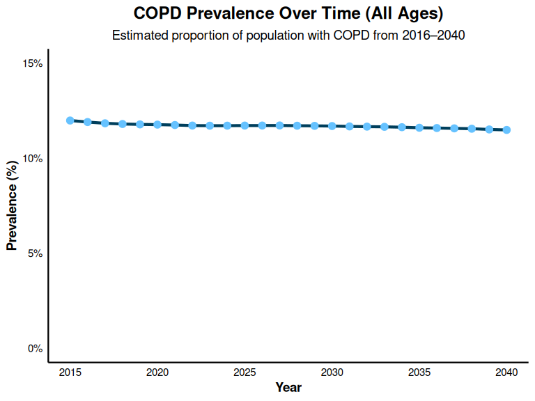
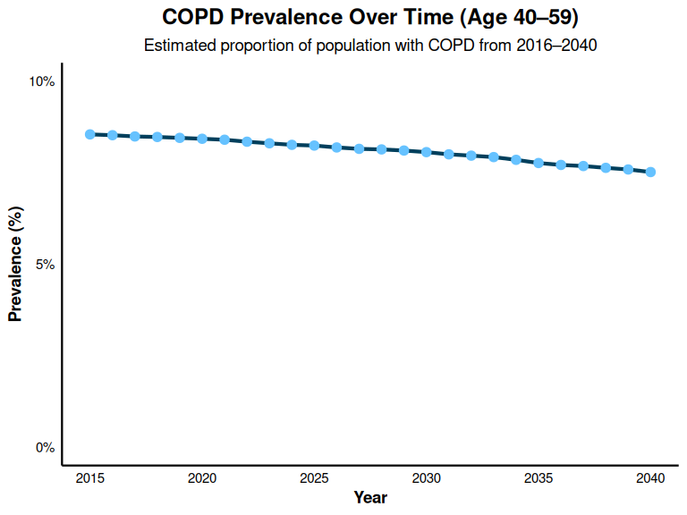
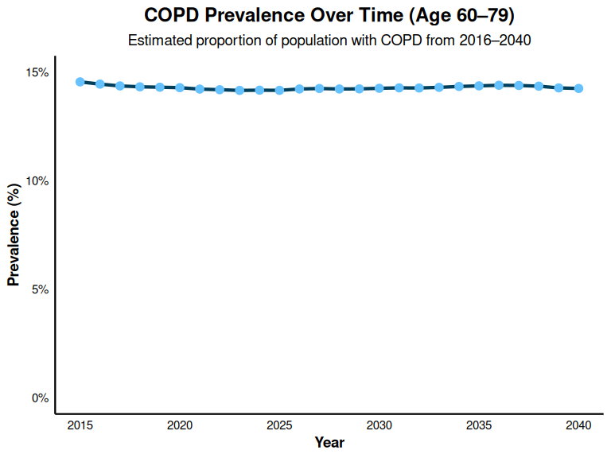

Calibrate COPD Prevalence
================

### Overview

This document outlines the calibration process undertaken to align the
model’s outputs with U.S.-based validation targets for COPD prevalence,
using NHANES data in which COPD was defined according to the Lower Limit
of Normal (LLN) definition. The calibration was conducted over a 25-year
simulation time horizon.

**Validation Reference:** Tilert et al. 2013 (DOI:
10.1186/1465-9921-14-103)

**Target Prevalence Rates from NHANES (Ages 40–79 years):**

**Age-specific prevalence:** 40–59 years: 8.1% 60–79 years: 14.4%

**Sex-specific prevalence:** Males: 12.0% Females: 8.6%

It is important to note that the EPIC model simulates individuals aged
40 and older, including those ≥80 years, whereas Tilert et al. 2013
included only individuals aged 40–79.

Given this limitation, the calibration emphasized preserving the
sex-specific prevalence ratio observed in Tilert et al. 2013 (1.4:1;
12.0% males vs. 8.6% females) as the validation target. The model was
deemed adequately calibrated if this ratio was maintained, even if
absolute prevalence values by sex differed slightly due to inclusion of
older age groups.

**Evolution of LLN Reference Equations and Impact on COPD Prevalence
Estimation**

Reference equations used to define the LLN for spirometry to diagnose
COPD have evolved over time, moving from race-specific models toward
more inclusive, race-neutral approaches. Tilert et al. 2013 defined COPD
using LLN values derived from the Hankinson equation, a race-specific
model widely used in earlier guidelines. In contrast, current guidelines
recommend using the Global Lung Function Initiative (GLI) race-neutral
reference equations. A recent analysis by Cadham et al. 2024 (DOI:
10.1186/s12931-024-02841-y) compared COPD prevalence estimates based on
the Hankinson and GLI race-neutral equations and found no significant
differences between the two approaches.

### Step 1: Load libraries and setup

Here, we load the necessary libraries. We also set the default
simulation settings and specify the time horizon for the simulation (25
years).

``` r
library(epicUS)
library(tidyverse)
library(ggplot2)
library(dplyr)
library(knitr)

# Load EPIC general settings
settings <- get_default_settings()
settings$record_mode <- 0
settings$n_base_agents <- 1e6
init_session(settings = settings)
```

    ## [1] 0

``` r
input <- get_input()
time_horizon <- 26
input$values$global_parameters$time_horizon <- time_horizon
```

### Step 2: Modify intercept value to calibrate proportion of COPD prevalence by age group and sex

The sex-specific intercepts were adjusted to match the age-specific
prevalence targets (age groups: 40–59 and 60–79 years) while maintaining
a 1.4:1 male-to-female ratio.

``` r
input$values$COPD$logit_p_COPD_betas_by_sex <- cbind(male = c(intercept = -4.15189, age = 0.033070,
                                                              age2 = 0, pack_years = 0.025049,
                                                              current_smoking = 0, year = 0, asthma =
                                                              0), 
                                                     female = c(intercept = -4.18486, age = 
                                                              0.027359,age2 = 0,pack_years =
                                                              0.030399,current_smoking = 0, year=
                                                              0, asthma = 0))
```

### Step 3: Run EPIC

``` r
# Run EPIC simulation
run(input = input$values)
```

    ## [1] 0

``` r
output <- Cget_output_ex()
terminate_session()
```

    ## Terminating the session

    ## [1] 0

### Step 4: Create data tables by age category

``` r
# Determine overall COPD prevalence

COPDprevalence_ctime_age<-output$n_COPD_by_ctime_age
COPDprevalence_ctime_age<-as.data.frame(output$n_COPD_by_ctime_age)
totalpopulation<-output$n_alive_by_ctime_age

# Overall prevalence of COPD

alive_age_all <- rowSums(output$n_alive_by_ctime_age[1:26, 40:111])
COPD_age_all <- rowSums (output$n_COPD_by_ctime_age[1:26, 40:111])
prevalenceCOPD_age_all <- COPD_age_all / alive_age_all

# Prevalence by age 40-59 

alive_age_40to59 <- rowSums(output$n_alive_by_ctime_age[1:26, 40:59])
COPD_age_40to59 <-rowSums(output$n_COPD_by_ctime_age[1:26, 40:59])
prevalenceCOPD_age_40to59 <- COPD_age_40to59 / alive_age_40to59

# Prevalence by age 60-79

alive_age_60to79 <- rowSums(output$n_alive_by_ctime_age[1:26, 60:79])
COPD_age_60to79 <-rowSums(output$n_COPD_by_ctime_age[1:26, 60:79])
prevalenceCOPD_age_60to79 <- COPD_age_60to79 / alive_age_60to79

# Prevalence by age 80+

alive_age_over80 <- rowSums(output$n_alive_by_ctime_age[1:26, 80:111])
COPD_age_over80 <-rowSums(output$n_COPD_by_ctime_age[1:26, 80:111])
prevalenceCOPD_age_over80 <- COPD_age_over80 / alive_age_over80

# Display summary of COPD prevalence by age group 

COPD_prevalence_summary <- data.frame(
  Year = 2015:2040,
  Prevalence_all = prevalenceCOPD_age_all,
  Prevalence_40to59 = prevalenceCOPD_age_40to59,
  Prevalence_60to79 = prevalenceCOPD_age_60to79,
  Prevalence_over80 = prevalenceCOPD_age_over80
  )

kable(COPD_prevalence_summary, 
      caption = "COPD Prevalence by Age Group Over Time",
      digits = 3)
```

| Year | Prevalence_all | Prevalence_40to59 | Prevalence_60to79 | Prevalence_over80 |
|-----:|---------------:|------------------:|------------------:|------------------:|
| 2015 |          0.120 |             0.085 |             0.145 |             0.241 |
| 2016 |          0.119 |             0.085 |             0.144 |             0.236 |
| 2017 |          0.118 |             0.085 |             0.144 |             0.232 |
| 2018 |          0.118 |             0.085 |             0.143 |             0.227 |
| 2019 |          0.118 |             0.084 |             0.143 |             0.224 |
| 2020 |          0.118 |             0.084 |             0.143 |             0.221 |
| 2021 |          0.117 |             0.084 |             0.142 |             0.219 |
| 2022 |          0.117 |             0.083 |             0.142 |             0.216 |
| 2023 |          0.117 |             0.083 |             0.142 |             0.215 |
| 2024 |          0.117 |             0.083 |             0.142 |             0.213 |
| 2025 |          0.117 |             0.082 |             0.142 |             0.211 |
| 2026 |          0.117 |             0.082 |             0.142 |             0.209 |
| 2027 |          0.117 |             0.081 |             0.142 |             0.208 |
| 2028 |          0.117 |             0.081 |             0.142 |             0.206 |
| 2029 |          0.117 |             0.081 |             0.142 |             0.205 |
| 2030 |          0.117 |             0.081 |             0.143 |             0.203 |
| 2031 |          0.117 |             0.080 |             0.143 |             0.202 |
| 2032 |          0.117 |             0.080 |             0.143 |             0.202 |
| 2033 |          0.116 |             0.079 |             0.143 |             0.201 |
| 2034 |          0.116 |             0.078 |             0.143 |             0.199 |
| 2035 |          0.116 |             0.078 |             0.144 |             0.198 |
| 2036 |          0.116 |             0.077 |             0.144 |             0.197 |
| 2037 |          0.116 |             0.077 |             0.144 |             0.195 |
| 2038 |          0.115 |             0.076 |             0.144 |             0.195 |
| 2039 |          0.115 |             0.076 |             0.143 |             0.195 |
| 2040 |          0.115 |             0.075 |             0.142 |             0.195 |

COPD Prevalence by Age Group Over Time

### Step 5: Visualize data by age category

COPD prevalence is projected to decline moderately between 2025 and
2050, as reported by Boers et al. 2023 (DOI:
10.1001/jamanetworkopen.2023.46598). A similar trend is observed in EPIC
model projections of overall COPD prevalence. However, a limitation of
EPIC include underestimating the size of the population aged 80 and
older. As COPD prevalence increases with age, this results in a
overestimation of overall COPD prevalence in the simulated population.

**COPD prevalence all age groups**



**COPD prevalence from age 40 to 59**



**COPD prevalence from age 60 to 79**



**COPD prevalence from age 80+**


### Step 6: Create data tables by sex to check if gender distribution matches Tilert et al 2013 (<doi:10.1186/1465-9921-14-103>))

``` r
# Calculate COPD prevalence by sex over time

alive_sex <- output$n_alive_by_ctime_sex
COPD_sex <- output$n_COPD_by_ctime_sex
prevalenceCOPD_sex <- COPD_sex / alive_sex
prevalenceCOPD_sex<-as.data.frame (prevalenceCOPD_sex)

# Rename columns
colnames(prevalenceCOPD_sex) <- c("Male", "Female")
prevalenceCOPD_sex$Year <- 2015:2040


# Display summary of COPD prevalence by sex

kable(prevalenceCOPD_sex,
  caption = "COPD Prevalence by Sex Over Time",
  digits = 3
)
```

|  Male | Female | Year |
|------:|-------:|-----:|
| 0.143 |  0.097 | 2015 |
| 0.141 |  0.097 | 2016 |
| 0.140 |  0.097 | 2017 |
| 0.139 |  0.097 | 2018 |
| 0.139 |  0.097 | 2019 |
| 0.138 |  0.098 | 2020 |
| 0.137 |  0.098 | 2021 |
| 0.137 |  0.099 | 2022 |
| 0.136 |  0.099 | 2023 |
| 0.136 |  0.100 | 2024 |
| 0.135 |  0.100 | 2025 |
| 0.135 |  0.101 | 2026 |
| 0.135 |  0.101 | 2027 |
| 0.134 |  0.101 | 2028 |
| 0.134 |  0.102 | 2029 |
| 0.133 |  0.102 | 2030 |
| 0.133 |  0.102 | 2031 |
| 0.132 |  0.102 | 2032 |
| 0.132 |  0.102 | 2033 |
| 0.131 |  0.103 | 2034 |
| 0.131 |  0.103 | 2035 |
| 0.131 |  0.103 | 2036 |
| 0.130 |  0.103 | 2037 |
| 0.130 |  0.103 | 2038 |
| 0.129 |  0.103 | 2039 |
| 0.129 |  0.102 | 2040 |

COPD Prevalence by Sex Over Time

### 
